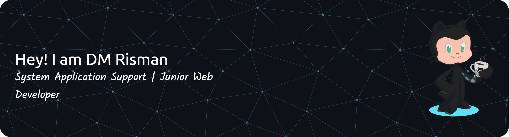

<!-- BILINGUAL README WITH LANGUAGE SWITCH (GitHub-friendly: uses 
) -->

  <strong>Language:</strong> <a href="#english">EN</a> · <a href="#bahasa-indonesia">ID</a>

  
<strong>English</strong>

   
  

  <h1>👋 Hi, I’m Risman Munawar</h1>
  
Developer who ships pragmatic web apps, automates busywork, and writes clear docs.

  

    
  

  

  <h2>🚀 About</h2>
  <ul style="text-align:left; max-width:820px; margin:auto;">
    <li>I build reliable, maintainable web applications end‑to‑end.</li>
    <li>I love turning repetitive manual steps into <em>automated workflows</em>.</li>
    <li>I care about clean UI, accessibility, and helpful documentation.</li>
  </ul>

  

  <h2>🛠 Stack</h2>
  

    
    
    
    
    
    
    
    
    
    
    
    
    
  

  
Also comfortable with: GitHub, Composer, basic CI/CD, and building dashboards with Google Sheets/Apps Script.

  

  <h2>📌 What I Do</h2>
  <ul style="text-align:left; max-width:820px; margin:auto;">
    <li><strong>Backend:</strong> API design, data modeling, auth, queues.</li>
    <li><strong>Frontend:</strong> Component‑driven UIs (React/Livewire), responsive design.</li>
    <li><strong>Ops:</strong> Lightweight deployments, environments, observability basics.</li>
    <li><strong>Productivity:</strong> Automations & dashboards that save teams hours.</li>
  </ul>

  

  <h2>✨ Highlights</h2>
  <ul style="text-align:left; max-width:820px; margin:auto;">
    <li>Delivered end‑to‑end web apps from idea to production, with clear documentation.</li>
    <li>Designed pragmatic architectures and data models that remain easy to extend.</li>
    <li>Built component‑driven, accessible, and responsive UIs.</li>
    <li>Automated repetitive tasks and reporting to free up team hours.</li>
    <li>Maintained code quality with tests and streamlined releases via CI/CD.</li>
    <li>Collaborated across functions; communicated trade‑offs and shipped iteratively.</li>
  </ul>

  

  <h2>📫 Connect</h2>
  

    
    
    
  

  

 
<!--

  
<strong>🇮🇩 Bahasa Indonesia</strong>

   
  

  <h1>👋 Halo, saya Risman Munawar</h1>
  
Developer yang fokus pada web app praktis, otomasi pekerjaan berulang, dan dokumentasi yang jelas.

  

    
  

  

  <h2>🚀 Tentang</h2>
  <ul style="text-align:left; max-width:820px; margin:auto;">
    <li>Membangun aplikasi web yang andal dan mudah dirawat dari ujung ke ujung.</li>
    <li>Suka mengubah langkah manual berulang menjadi <em>workflow otomatis</em>.</li>
    <li>Peduli pada UI yang rapi, aksesibilitas, dan dokumentasi yang membantu.</li>
  </ul>

  

  <h2>🛠 Teknologi</h2>
  

    
    
    
    
    
    
    
    
    
    
    
    
    
  

  
Juga nyaman dengan: GitHub, Composer, CI/CD dasar, serta membuat dashboard pakai Google Sheets/Apps Script.

  

  <h2>📌 Yang Saya Kerjakan</h2>
  <ul style="text-align:left; max-width:820px; margin:auto;">
    <li><strong>Backend:</strong> Desain API, pemodelan data, autentikasi, antrian/queue.</li>
    <li><strong>Frontend:</strong> UI berbasis komponen (React/Livewire), desain responsif.</li>
    <li><strong>Ops:</strong> Deploy ringan, manajemen environment, dasar observability.</li>
    <li><strong>Produktivitas:</strong> Otomasi & dashboard yang menghemat banyak waktu tim.</li>
  </ul>

  

  <h2>✨ Sorotan</h2>
  <ul style="text-align:left; max-width:820px; margin:auto;">
    <li>Mengirimkan aplikasi web end‑to‑end dari ide hingga produksi, disertai dokumentasi yang jelas.</li>
    <li>Merancang arsitektur dan model data yang pragmatis dan mudah dikembangkan.</li>
    <li>Membangun UI berbasis komponen yang aksesibel dan responsif.</li>
    <li>Mengotomasi tugas berulang serta pelaporan untuk menghemat waktu tim.</li>
    <li>Menjaga kualitas kode dengan test dan rilis yang mulus melalui CI/CD.</li>
    <li>Kolaborasi lintas fungsi; komunikatif soal trade‑off dan iterasi cepat.</li>
  </ul>

  

  <h2>📫 Terhubung</h2>
  

    
    
    
  

  
Aksen: <code>#0a152f</code> • Teks: <code>#e6edf3</code> • Tautan: <code>#58a6ff</code>

  

 -->
